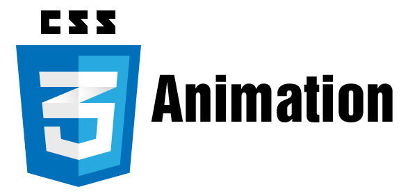
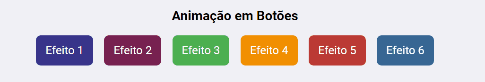
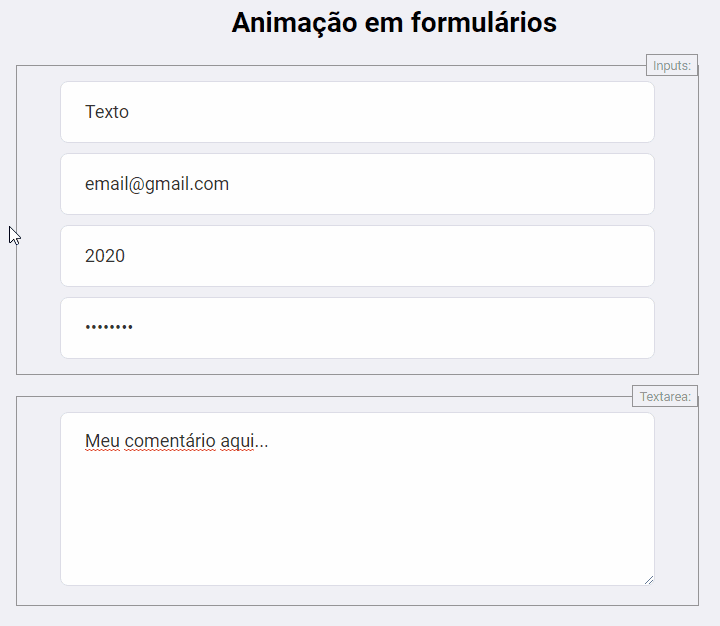

<h1 align="center">
    
</h1>

<p align="center">
  
  
  
  
  
</p>

<p align="center">
  <a href="https://github.com/devluma/animations-css3-examples/releases">
    
  </a>
  <a href="https://github.com/devluma/animations-css3-examples/commits/master">
    
  </a>
  <a href="https://github.com/devluma/animations-css3-examples/issues">
    
  </a>
  <a href="https://github.com/devluma/animations-css3-examples/archive/master.zip">
    
  </a>
</p>

<p align="center">
  
  <a href="https://github.com/devluma" target="_blank" >
    
  </a>
  <a href="https://www.linkedin.com/in/devluma/" target="_blank" >
    
  </a>
  <a href="mailto:luiz.schmitt@sysdomotic.com.br" target="_blank" >
    
  </a>
</p>

<p align="center">
  <a href="#desafio-proposto">Desafio</a>&nbsp;&nbsp;|&nbsp;&nbsp;
  <a href="#além-do-desafio">Implementações</a>&nbsp;&nbsp;|&nbsp;&nbsp;
  <a href="#-descrição-do-projeto">Descrição do Projeto</a>&nbsp;&nbsp;|&nbsp;&nbsp;
  <a href="#information_source-como-usar">Como Usar</a>&nbsp;&nbsp;|&nbsp;&nbsp;
  <a href="#-contribuições">Contribuições</a>&nbsp;&nbsp;
</p>

<br />

# Projeto `Animações em CSS3`

A aplicação tem como objetivo estudar HTML5 e CSS3, para aprimorar meus conhecimento no desenvolvimento Front-end. A Abordagem utilizada nos exemplos foi resumida do vídeo criado pelo [Ricardo Sanches](https://www.youtube.com/watch?v=_w57bWIPZKE).

# Desafio proposto!

📌 Criar exemplos de animação em CSS3 para utilizar nas aplicações da [Sysdomotic](https://www.sysdomotic.com.br/).

## Além do desafio!

- ✔️ Criar efeitos em botões do HTML5 / [W3Schools](https://www.w3schools.com/howto/howto_css_animate_buttons.asp)
- ✔️ Criar efeitos em campos de um formulário do HTML5 como tipo (Text, Email, Number e Password)
- ✔️ Criar efeitos em campos do tipo (Textarea) de um formulário do HTML5.


# 🚢 Descrição do Projeto:

### 👉 Animação em Botões:

Animações em botões são muito legais 😛 e uteis no dia-dia do desenvolvimento de aplicações web.

<table>
  <thead>
    <th>
      <b>Botões:</b>
    </th>
  </thead>
  <tbody>
    <tr>
      <td>
        
      </td>
    </tr>
  </tbody>
</table>

### 👉 Animação em Formulários

Animações em campos de formulários são muito uteis no dia-dia do desenvolvimento de aplicações web 🙈.

<table>
  <thead>
    <th>
      <b>Inputs de formulário:</b>
    </th>
  </thead>
  <tbody>
    <tr>
      <td>
        
      </td>
    </tr>
  </tbody>
</table>

### :information_source: Como Usar

Para clonar e executar este projeto, você precisará do [Git](https://git-scm.com/book/en/v2/Getting-Started-Installing-Git) instalado no seu computador.

#### 💻 Executar na Linha de Comando

```bash
# Clone o repositório no diretório desejado
$ git clone https://github.com/devluma/animations-css3-examples.git

# Vá para o diretório onde o projeto foi clonado
$ cd animations-css3-examples/

# Abrir o projeto no VS Code
$ code .
```

# 🚀 Tecnologia(s) Utilizada(s) no Projeto

<table>
  <thead>
    <th>Front-end</th>
  </thead>
  <tbody>
    <tr>
      <td>HTML5</td>
    </tr>
    <tr>
      <td>CSS3</td>
    </tr>
  </tbody>
  
</table>

# 🔌 Link(s) da(s) Bibliografia(s) Utilizada(s)

- [Animações com CSS3 do Ricardo Sanches](https://www.youtube.com/watch?v=_w57bWIPZKE/)

# 🤝 Contribuições

😉 Contribuições são <b>Bem-Vindas</b>! <br />
🌈 Sinta-se livre para abrir uma <b>ISSUE</b> ou um <b>PULL REQUEST</b> e participar do projeto como você desejar.

### 🤘 Mostre o seu Apoio 💞

Dê uma ⭐️ se este projeto te ajudou de alguma forma 😉🎅

# 📜 Direitos e Licença

✌ Este projeto está sobre [Licença MIT](https://choosealicense.com/licenses/mit/) e foi criado por [Luiz Marcelo Schmitt](https://www.linkedin.com/in/devluma/)

# 🙌 Apoio

<p align="left">
  <span>&nbsp;&nbsp;&nbsp;&nbsp;</span>
  <span align="left">
    <a href="https://www.sysdomotic.com.br/" target="_blank">
      
    </a>
  </span>
  <span>&nbsp;&nbsp;&nbsp;&nbsp;</span>
  <span align="left">
    <a href="https://www.maizzon.com.br/" target="_blank"  margin="15px">
      
    </a>
  </span>
</p>

---

Desenvolvido por [Devluma](https://devluma.github.io/about-me) :blue_heart:

###### <div align="right">[Voltar](#projeto-be-the-hero) ↺</div>